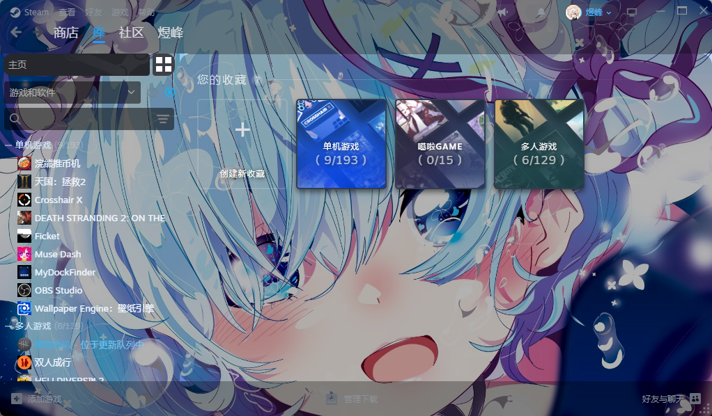

# steam 雷姆

基于 [Millennium](https://github.com/SteamClientHomebrew/Millennium) 框架的 Steam 皮肤

## 功能

- MD3 风格圆角设计
- 深色/明亮主题切换
- 自定义背景图片

## 安装

1. 安装 [Millennium](https://github.com/SteamClientHomebrew/Millennium)
2. 将皮肤文件夹放入 `steamui/skins/` 目录
3. 在 Millennium 设置中选择皮肤

## 自定义背景

通过 修改图片（main.jpg） 可实现自定义背景，背景图片推荐分辨率 1920×1080
